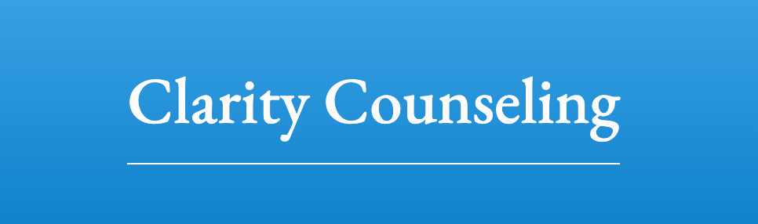

# Clarity Relationships

## Description
This is a website created for Clarity Counseling. It informing users about the services that the business provides and allows them to send a message.

## Details
This project was built with HTML, CSS, and a bit of JS.
It is currently hosted on Netlify.com for free under Denisse Del Monte's (my) account.
The domain is managed through Clarity Relationships' NameCheap account.

<!-- To edit this project:
-  Fork this repo
-  Make edits
-  Publish the changes -->